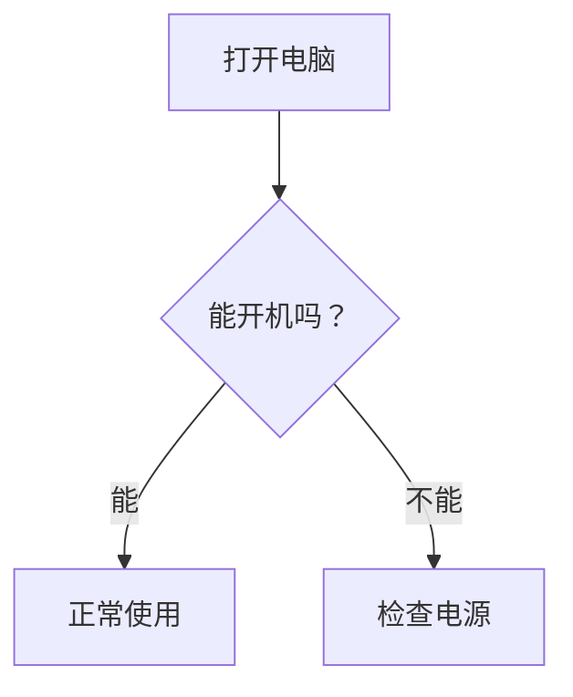
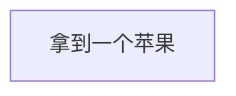
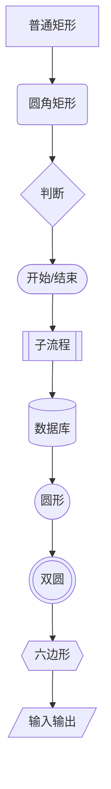
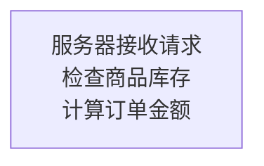
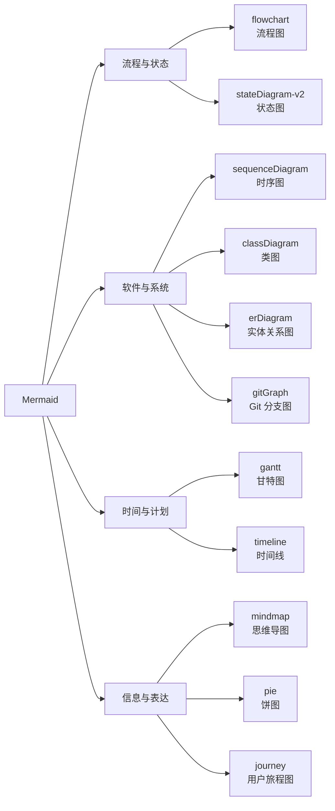

# Mermaid 流程图 学习笔记
2026.8.22
### 1.Mermaid 是什么有什么用
Mermaid 是一种用文本描述图表关系的语法，适合用于表述各种纯文字无法很好描述的思维结构。同时，它也非常适合写进 Markdown 文件中，可以在 GitHub、文档等地方，用一张图简洁地表述项目的主要思路和框架。

### 2.从mermaid flowchart开始
想要在markdown文件里面插入一段：

要召唤这样的图表需要先吟唱一段咒语，告诉markdown文档我要在此处插入一个mermaid图标，它的代码格式是这样的：
````
```mermaid
flowchart TD
```
````
翻译翻译就是```把mermaid叫出来，flowchart就是在告诉 Mermaid：我要画流程图了！TD当然不是退订，它的意思是方向，TD是从上到下，自然也有其他的方向，如表格所示：
| 缩写 | 英文全称 | 方向 |
|---|---|---|
| TD | Top Down | 上 → 下 |
| TB | Top Bottom | 上 → 下 |
| BT | Bottom Top | 下 → 上 |
| LR | Left Right | 左 → 右 |
| RL | Right Left | 右 → 左 |

把流程图和方向告诉markdown，下一步就是填充内容，其实就是把一个个节点一起拼起来，但是节点 ID 和显示名称不是同一个东西，例如

````

````
这里apple是节点 ID。而,拿到一个苹果才是图中显示的文字，ID叫什么其实无所谓，主要看项目和心情，只要自己方便理解，能看出来写的是什么就可以了。
而节点呢，除了“[]”以外还有一下这些：

他们都有各自不同的功能划分和代码表达，当需要从一个节点指向下一个节点不仅可以从```apple["拿到一个苹果"]-->apple["拿到一个苹果"]```这样指向，也可以像刚刚的图例一样先把节点列好，最后进行方向补充：```A --> B --> C --> D --> E
    E --> F --> G --> H --> I --> J```
要在节点里换行也很简单：

````

````
加一个```<br/>```即可解决
### 3.除了flowchart，mermaid还有什么
Mermaid 官方现在支持的图表类型其实已经非常多了，包括流程图、泳道图、时序图、类图、状态图、ER 图、甘特图、思维导图、时间线、Git 图、Kanban、架构图、雷达图、Venn 图等，以下有一些常用的咒语名称方便替换：

| Mermaid 类型 | 它主要回答什么？ |
| --- | --- |
| `flowchart` | 事情怎么走？|
| `sequenceDiagram` | 谁先跟谁通信？ |
| `classDiagram` | 程序中的对象是什么关系？ |
| `stateDiagram-v2` | 东西怎么从一种状态变成另一种？ |
| `erDiagram` | 数据库数据是什么关系？ |
| `gantt` | 什么时候做什么？ |
| `mindmap` | 一个概念包含哪些东西？ |
| `timeline` | 过去发生了什么？ |
| `gitGraph` | 代码分支怎么发展、合并？ |
| `pie` | 各部分占多少？ |
| `journey` | 用户经历每一步时感觉怎么样？ |
